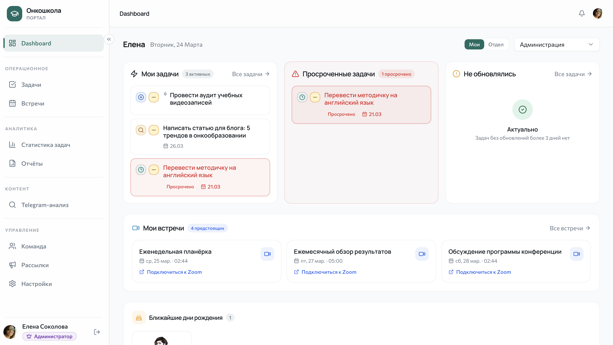
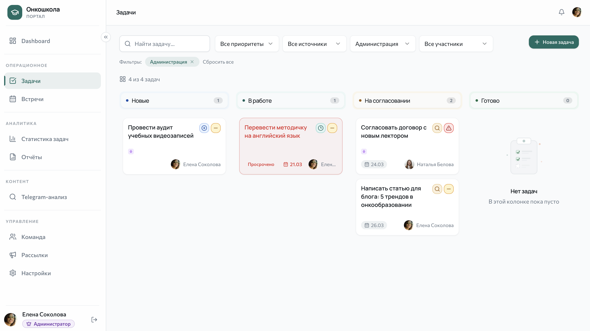
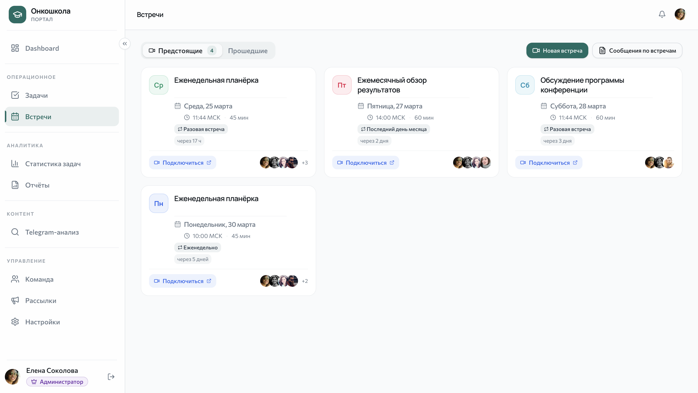
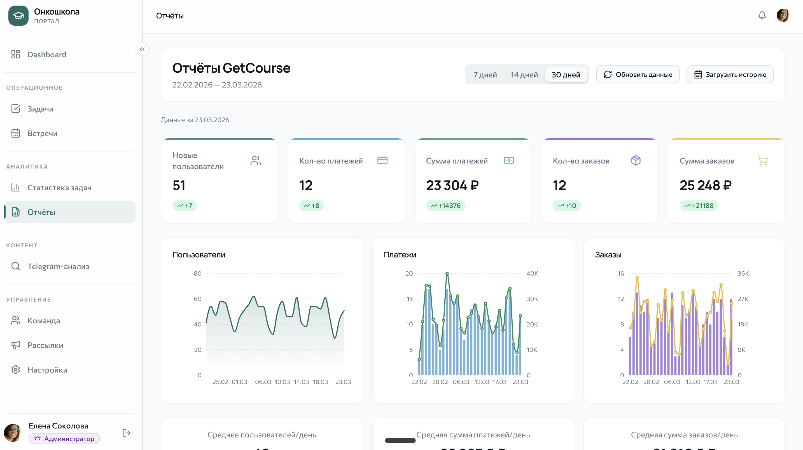
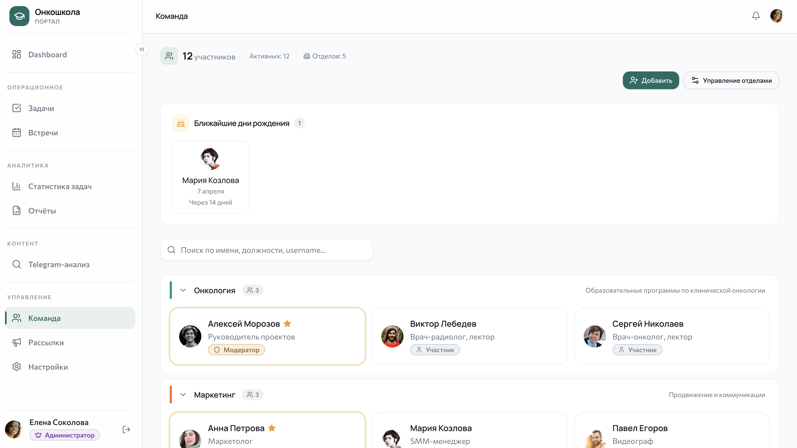

# Oncoschool Team Portal

> **[Live Demo](https://task-manager-oncoschool.vercel.app)** · *Authentication required — see screenshots below for a full UI walkthrough.*

A team portal for ~20 people with two entry points: **Telegram bot** and **web interface**.

## Features

- **Tasks** — Telegram bot + Kanban board, voice task creation (Whisper STT + AI), AI parsing of Zoom Summary
- **Meetings** — scheduling, Zoom integration, transcriptions, automatic task creation
- **Reports** — GetCourse integration, daily KPIs, charts and tables
- **Content analysis** — Telegram channel monitoring with AI analysis
- **Broadcasts** — mass notifications via Telegram bot
- Role-based access: admin / moderator / member
- Daily digests and reminders
- Multi-provider AI: OpenAI / Anthropic / Gemini

## Tech Stack

| Component | Technologies |
|-----------|------------|
| **Backend** | Python 3.12, FastAPI, aiogram 3.x, SQLAlchemy 2.0, APScheduler |
| **Frontend** | Next.js 14, TypeScript, Tailwind CSS, shadcn/ui, recharts |
| **Database** | PostgreSQL (Supabase) |
| **AI** | OpenAI / Anthropic / Gemini (switchable), Whisper STT |
| **Deploy** | Vercel (frontend) + Railway (backend) |

## Screenshots

| | |
|:---:|:---:|
|  |  |
| **Dashboard** — overview of tasks, meetings, and birthdays | **Tasks** — Kanban board with filters and priorities |
|  |  |
| **Analytics** — KPIs, status breakdown, flow dynamics | **Meetings** — schedule with Zoom integration |
|  |  |
| **Reports** — GetCourse KPI dashboard with charts | **Team** — org tree with departments and roles |

## Architecture

**Dual entry point** — Telegram bot (aiogram 3.x) and REST API (FastAPI) run in a single process, sharing one service layer (TaskService, MeetingService, AIService) and database. Business logic is written once — both interfaces use the same services.

**AI multi-provider** — Strategy pattern: three providers (Anthropic, OpenAI, Gemini) implement a single `AIProvider` ABC. Provider and model are configured per feature (meetings, voice, content analysis) via `ai_feature_config` table and switch without restart.

**Voice → Task pipeline** — voice message → Whisper STT → AI parsing → structured preview (title, assignee, priority, deadline) → confirm/edit → task. Works in private chats and group chats.

**RBAC with department scope** — three roles (admin / moderator / member) with field-level control: PermissionService defines which task fields each role can edit. Task visibility is scoped by department — members see only their department, department heads see their departments.

**Async stack** — SQLAlchemy 2.0 async + asyncpg, APScheduler AsyncIOScheduler. Middleware injects `session_maker`, handlers create their own sessions — thread-safe processing without blocking.

**Scheduler replaces n8n** — MeetingSchedulerService (APScheduler) auto-creates Zoom meetings on schedule, sends Telegram reminders to multiple groups with thread support, syncs transcriptions.

**Graceful fallback** — Zoom and Supabase Storage are optional. Without Zoom — meetings are local events. Without Supabase — avatars stored on local disk. The system works in any configuration.

**Encrypted Telegram userbot** — Pyrofork client for channel monitoring. Session and API credentials are stored encrypted in DB (Fernet). Connection via 2-step flow with 2FA support.

## What I Learned

### Async Python goes deeper than `await`

Running SQLAlchemy, a Telegram bot, and scheduled jobs in one async process exposed subtle issues: background tasks outliving request sessions, parallel API calls causing duplicate token refreshes, ORM objects going stale after commit. Each required a specific fix — own sessions for background work, async locks for shared state, careful ORM configuration. The lesson: async concurrency bugs are silent until production load.

### Telegram bot architecture rewards middleware investment

A single middleware that authenticates users and injects database sessions into every handler eliminated repetitive boilerplate across 15+ handler files. FSM (Finite State Machine) turned complex multi-step flows — voice → transcription → AI parse → preview → edit → confirm — into clean state transitions instead of nested callbacks. The bot and web API share the same service layer, so business logic is written once.

### Zoom integration is 20% OAuth, 80% edge cases

The Server-to-Server OAuth flow is straightforward. The real work: parsing VTT transcripts (timestamps, speaker segments, encoding), handling rate limits, and making Zoom entirely optional — the app runs without Zoom credentials, treating meetings as local events. Designing integrations as optional from day one saved significant refactoring later.

### AI multi-provider needs per-feature config

A single global "current AI provider" toggle worked until different features needed different models — fast models for quick parsing, stronger ones for content analysis. A per-feature config table with fallback to global default solved this cleanly. Other lessons: always strip markdown fences from LLM JSON output, and chunk large texts with overlap to avoid losing context at boundaries.

### SSE streaming has invisible infrastructure requirements

Browser EventSource cannot send auth headers — JWT goes via query parameter. Reverse proxies buffer responses by default, silently breaking the stream. Long-lived connections need periodic heartbeats or they get dropped. None of this is in the SSE spec — each was discovered through debugging in production-like conditions.

## Quick Start

### Local Development

```bash
# 1. Backend
cd backend
cp .env.example .env   # fill in the variables
pip install -e .
alembic upgrade head
python -m app.main

# 2. Frontend
cd frontend
cp .env.local.example .env.local
npm install
npm run dev
```

### Docker

```bash
# Fill in backend/.env
cp backend/.env.example backend/.env

# Start all services
docker compose up --build
```

## Documentation

- Documentation map: `docs/README.md`
- Archived plans: `docs/plans/archive/`
- Integration runbooks: `docs/runbooks/`
- AI guides for interfaces: `docs/ai/`

## Changelog

The project uses a change-fragment approach:

- Each relevant change is stored as a separate file in `.changes/`;
- The final `CHANGELOG.md` is assembled automatically from these fragments.

### Recording Modes

- `business` — change relevant for a business report;
- `internal` — internal technical change;
- `none` — no change fragment is created.

### Commands

```bash
# Create a change fragment
make change-add ARGS="--scope business --task ONCO-142 --type feature --area 'Scheduling' --summary 'Added auto slot selection for doctor' --business-value 'Reduced patient scheduling time' --risk low"

# Build CHANGELOG.md from .changes/*.md
make change-build
```

## Environment Variables

### Backend (`backend/.env`)

| Variable | Description | Required |
|----------|----------|:----:|
| `BOT_TOKEN` | Telegram Bot Token from @BotFather | yes |
| `DATABASE_URL` | PostgreSQL connection string (asyncpg) | yes |
| `OPENAI_API_KEY` | OpenAI API key (Whisper STT + GPT) | yes |
| `ANTHROPIC_API_KEY` | Anthropic API key | no |
| `GOOGLE_API_KEY` | Google Gemini API key | no |
| `ADMIN_TELEGRAM_IDS` | Admin Telegram IDs, comma-separated | yes |
| `JWT_SECRET` | JWT secret (auto-generated from BOT_TOKEN) | no |
| `TIMEZONE` | Timezone (default: Europe/Moscow) | no |
| `CORS_ORIGINS` | JSON array of allowed origins | no |

### Frontend (`frontend/.env.local`)

| Variable | Description |
|----------|----------|
| `NEXT_PUBLIC_API_URL` | Backend URL (default: http://localhost:8000) |

## Deployment

### Railway (Backend)

1. Create a project on [Railway](https://railway.app)
2. Add a PostgreSQL service
3. Connect the GitHub repository, set root directory: `backend`
4. Set environment variables (see table above)
5. `DATABASE_URL` — from the Railway PostgreSQL service (replace `postgresql://` with `postgresql+asyncpg://`)
6. Add `CORS_ORIGINS` with the Vercel frontend URL

### Vercel (Frontend)

1. Import the repository on [Vercel](https://vercel.com)
2. Root directory: `frontend`
3. Framework preset: Next.js
4. Add the variable `NEXT_PUBLIC_API_URL` = Railway backend URL

## Project Structure

```
├── backend/
│   ├── app/
│   │   ├── main.py           # FastAPI + aiogram + APScheduler
│   │   ├── config.py         # Pydantic Settings
│   │   ├── bot/handlers/     # Telegram bot handlers
│   │   ├── api/              # REST API endpoints
│   │   ├── services/         # Business logic
│   │   └── db/               # Models, repositories, migrations
│   ├── alembic/              # Migrations
│   ├── Dockerfile
│   └── pyproject.toml
├── frontend/
│   ├── src/
│   │   ├── app/              # Next.js App Router pages
│   │   ├── components/       # React components
│   │   ├── lib/              # API client, types, utilities
│   │   └── hooks/            # React hooks
│   ├── Dockerfile
│   └── package.json
├── docs/
│   ├── README.md             # Documentation map
│   ├── ai/                   # AI guides
│   ├── runbooks/             # Operations runbooks
│   └── plans/archive/        # Historical implementation plans
├── docker-compose.yml
└── README.md
```

## Bot Commands

Tasks in Telegram work in inline mode: the `/tasks` command opens a list with filter, pagination, and task detail buttons.

### For Everyone
| Command | Description |
|---------|----------|
| `/start` | Welcome + registration |
| `/help` | List of commands |
| `/tasks` | My tasks |
| `/all` | Department/company tasks (depends on role) |
| `/new <text>` | Create a task for yourself |
| `/done <id>` | Complete a task |
| `/update <id> <text>` | Progress update |
| `/status <id> <status>` | Change status |
| `/myreminder` | My reminder settings |
| Voice message | Create a task by voice |

### Moderator Only
| Command | Description |
|---------|----------|
| `/assign @user <text>` | Assign a task |
| `/summary` | Process Zoom Summary |
| `/meetings` | Meeting history |
| `/stats` | Team statistics |
| `/reminders` | Reminder settings |
| `/subscribe` | Notification subscriptions |
| `/aimodel` | Current AI model |

## Task Visibility Rules

| Role / Scenario | Web Dashboard | Web `/tasks` + API `/api/tasks` | Telegram `/tasks` | Telegram `/all` |
|---|---|---|---|---|
| `member` with department | Summary cards: my tasks. Small cards: selected accessible department (usually own). Task block: "my" only. | Sees tasks of own department. Filters work within accessible scope only. | Own tasks only. | Tasks of own department. |
| `member` without department | Summary cards: my tasks. Small/department: not selected (0). | Fallback: own tasks only (even when filtering by another department). | Own tasks only. | Fallback: own tasks only (no department selected). |
| `department head` (role: `member`) | Can toggle "my/department" block for the department they lead. | Sees tasks of accessible departments (own + departments where they are head); access denied outside these. | Own tasks only. | Tasks of selected accessible department (choice among allowed departments). |
| `moderator` / `admin` | Full overview: own + any selected department. | Sees all company tasks, can filter by any department/assignee. | Own tasks only. | Company tasks with "all departments" or specific department selection. |

### Security Invariants

- Task and update access is checked on the backend using a single visibility rule (role + department).
- `department_id` passed to the API is validated: inaccessible departments return `403`.
- In Telegram, task details and update timelines are inaccessible outside the allowed visibility scope.

## API

Main endpoints:

- `POST /api/auth/login` — authentication by Telegram ID
- `GET /api/tasks` — task list (filters, pagination)
- `POST /api/tasks` — create a task
- `GET /api/tasks/{short_id}/updates` — update timeline
- `GET /api/meetings` — meeting list
- `POST /api/meetings/parse-summary` — AI summary parsing
- `GET /api/analytics/overview` — general analytics
- `GET /api/settings/ai` — current AI provider
